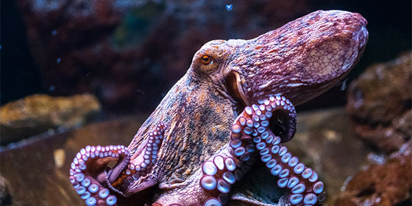
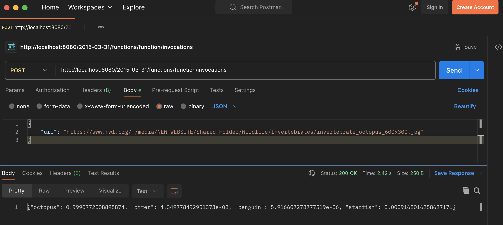
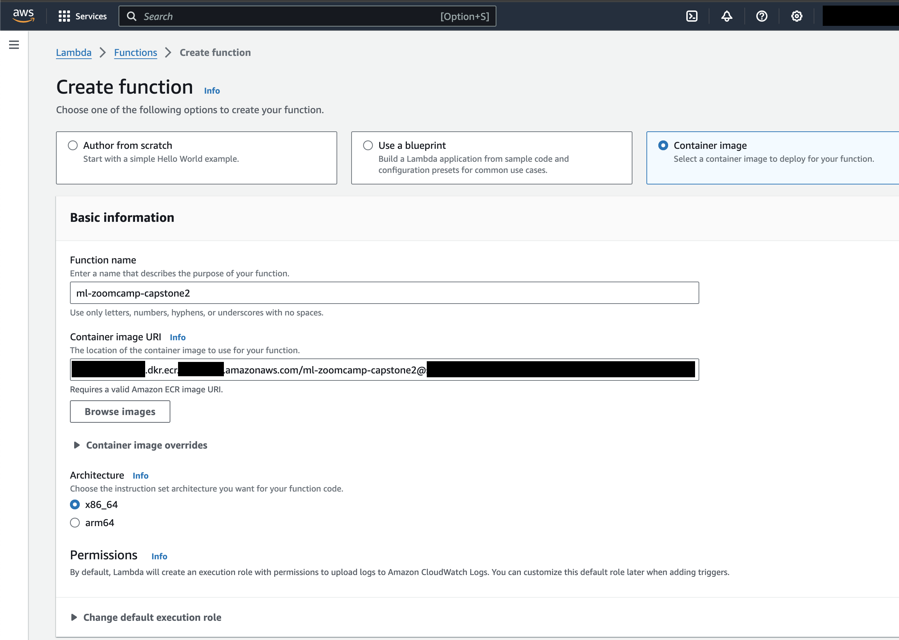
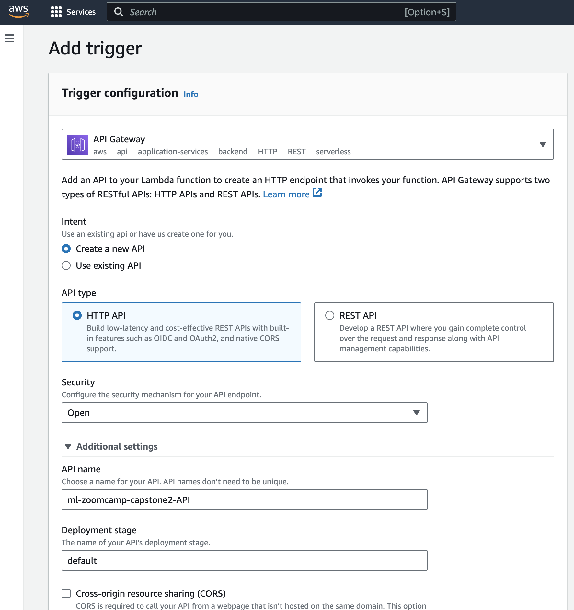
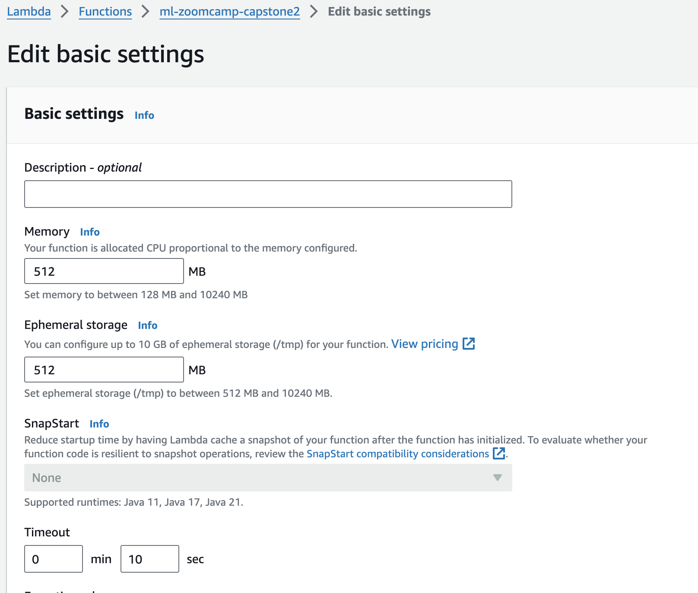
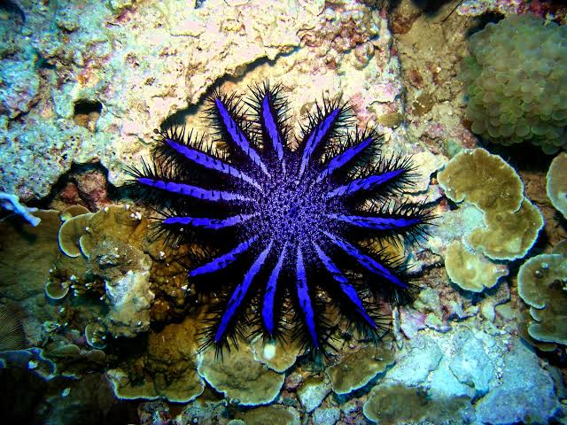
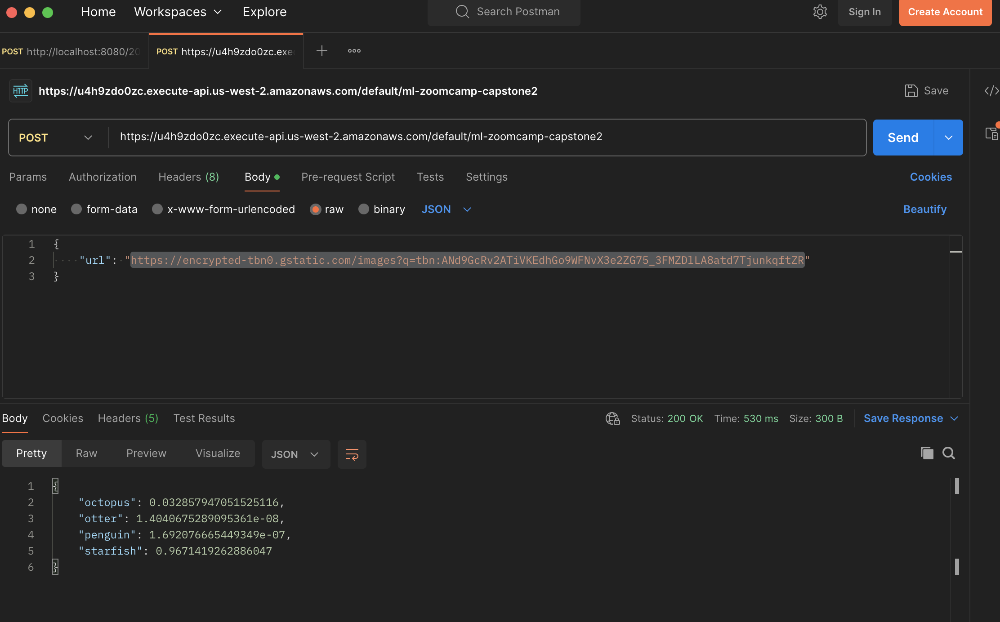

# Sea creature classifier

## Problem statement

This is the capstone project for DataTalksClub's Machine Learning Zoomcamp. I am using the [Sea Animals Image Dataset](https://www.kaggle.com/datasets/vencerlanz09/sea-animals-image-dataste) on Kaggle. I was inspired by the [Fathomnet project](https://fathomnet.org).

The Fathomnet project is particularly interesting, because it "[enables] the future of conservation, exploration, and discovery" of the ocean (from their website). The ocean is one of the final frontiers for discovery, and the more we know about it, the more we can understand how to take care of it better. For example, a lot of research is going into determining the levels of ocean pollution and its impact on all life. However, it's not so easy for people to navigate the deep oceans, so organizations such as [MBARI](https://www.mbari.org/) build underwater robots to capture images and video, as well as map the ocean floor. AI can help us understand what's in the captured data.

In this project, I am building a simple sea creature classifier. Given an image, my web service will determine what kind of sea creature it is.


## Exploratory Data Analysis

This project uses (a subset of) the [Sea Animals Image Dataset](https://www.kaggle.com/datasets/vencerlanz09/sea-animals-image-dataste)

* 23 different sea animal classes
* At most 300px in height or width
* JPEG files

While initially training the model, it took a very long time to train because of how many classes, and the accuracy of the model was quite low (< 30%). I decided to reduce the number of classes I would train the model on so I would have enough time to work on getting the model deployed. While this does change the problem a bit, I figured it is ok to scope down the problem in order to deliver an image classifier that I trained on my own.

Further exploration of the data (e.g. distribution of images per class, duplicate image occurrences) is in [notebook.ipynb](notebook.ipynb) (note: notebook is large, either download it or use [NbViewer](https://nbviewer.org/github/carise/ml-zoomcamp-capstone2/blob/main/notebook.ipynb))


### Image preprocessing
As part of EDA, I did some preprocessing:

* Remove duplicate images, to reduce overfitting and/or bias (`remove_duplicates.py`)
* Add padding to images to prevent distortion when resizing as input to the model (`pad_images.py`)
* Choose a subset of categories for which to build the image classifier (this was done manually - I looked at the available classes and picked several creatures).


### Cleaning the data

I have provided all the data I processed and trained on. You can find the raw dataset in `data/` and the cleaned and padded images in `cleaned_padded_data/`.

To run the `remove_duplicates.py` file, you'll need to have `tkinter` available (the functionality using `tkinter` allows the user to pick which image to keep out of the duplicates). The more recent versions of python 3.11 might not have `tkinter` compiled in, so you'll need to refer to other documentation to do that (e.g. [StackOverflow](https://stackoverflow.com/questions/76105218/why-does-tkinter-or-turtle-seem-to-be-missing-or-broken-shouldnt-it-be-part)). As mentioned already, I've already provided all the cleaned data, so you can skip this part unless you're curious about how it works. I'm also aware that there are other scripts and AI-assisted duplicate image removal, but I did not want to create other dependencies just to do a simple image deduplication.

```
# in same directory where data/ lives
pipenv run python remove_duplicates.py

# or with vanilla python
python remove_duplicates.py
```

This should output unique images to `cleaned_data/`.

To add padding to the images:

```
# in same directory where cleaned_data/ lives
pipenv run python pad_images.py

# or with vanilla python
python pad_images.py
```

### Data analysis and preparation

The data was split into train/validation/test sets (60%/20%/20%) and determined to have no duplicate filenames. The classes were more or less balanced: about 300 images per class for training, and 100 images per class in validation and test.

For the CNN, data augmentation is performed (e.g. image flips, shifts, etc.). For ResNet50, the keras `preprocess_input` function is applied.


## Training the model

I trained a CNN and a model with ResNet50 as the base layer.

* Train a CNN
    * 2 Conv2D layers - tune the filters
    * Adam optimizer - tune learning rate
    * Inner dense layer - tune units
* Train a model with [ResNet50](https://keras.io/api/applications/resnet/) as the base layer
    * Adam optimizer - tune learning rate
    * Inner dense layer - tune units
    * With/without dropout
    * With/without batch normalization
    * With/without training some layers in the base layer
    * Unfreeze some layers for training in ResNet50


## Model Evaluation

Metrics used for evaluating the model:
* validation accuracy and loss
* confusion matrix
* accuracy, precision, recall, F1 score

The model trained on ResNet50 is more accurate than the CNN trained only on the data set (98% vs 69% validation accuracy). Loss is also better, 0.08 vs 0.77. Precision, recall, and F1 score were higher for the ResNet50 model.

The one thing I am not sure about is why the validation accuracy for the ResNet50 trained model is so low (25-30%). I ran out of time to work on it, so I'll revisit that later.


## Deployment

* Export the final model in TFLite format
* Put training code in `train.py`
* Local and cloud deployment (details below)
 

## Running the code

The commands provided in this README have been tested in MacOS (`pipenv`) and WSL2 Ubuntu (`pip`).

### Git LFS
You might need to install git-lfs. See [Git-LFS](https://git-lfs.com/) for more info.

### Install dependencies

Prerequisites: Python 3.11+, `pipenv`

(I had trouble getting `pipenv` to work cross-platform. I started developing this project in MacOS and then decided to use Windows/WSL2 Ubuntu to do the model training. When I tried to install the `pipenv` environment, several important packages wouldn't install properly, so I exported my `pipenv` dependencies to `requirements*.txt`. I've provided the equivalent `pip` commands below.)

Install pip dependencies
```
pipenv install

# or
pip install -r requirements.txt
```

If you want to run the notebook, you'll also want to install the dev dependencies
```
pipenv install --dev

# or
pip install -r requirements-dev.txt
```


### Jupyter notebook

The notebook contains the data cleaning, analysis, and model training.

To run the notebook:
```
pipenv run jupyter notebook
```

### Training the final model

```
pipenv run python train.py
```

This will output the model as a file called `model.tflite`

### TFLite

To test loading of the TFLite model and making predictions with it, I've created the `notebook-test.ipynb`. This notebook loads TFLite from the Tensorflow library (I was unable to install a `tflite_runtime` wheel in WSL or MacOS).

The model will be deployed using a pre-built [`tflite_runtime`](https://github.com/alexeygrigorev/tflite-aws-lambda/tree/main).


## Run server locally

The model will be deployed via AWS Lambda. To run it locally:

Build the Docker image:
```
docker build -t sea-class .
```

Run the Docker container:
```
docker run -dp 8080:8080 sea-class:latest
```

### Send requests to local lambda function

Test image



#### Test script
Edit the `data.url` in `test.py` if you want to use a different image url.

```
pipenv run python test.py

# output: {"octopus": 0.9990772008895874, "otter": 4.349778492951373e-08, "penguin": 5.916607278777519e-06, "starfish": 0.0009168016258627176}
```

#### `curl`
```
curl -X POST -H "Content-Type: application/json" \
    http://localhost:8080/2015-03-31/functions/function/invocations \
    -d '{"url": "https://www.nwf.org/-/media/NEW-WEBSITE/Shared-Folder/Wildlife/Invertebrates/invertebrate_octopus_600x300.jpg"}'

# output: {"octopus": 0.9990772008895874, "otter": 4.349778492951373e-08, "penguin": 5.916607278777519e-06, "starfish": 0.0009168016258627176}
```

#### Postman
You can use [Postman](https://www.postman.com/downloads/) to send requests to the API.




## Cloud deployment

I've deployed the model to AWS Lambda. **Please be patient**, when you invoke the function, it takes a few seconds to start if it's not warmed up.

### Deployment details

#### Environment variables
Set profile (optional), account id, and region
```
export AWS_PROFILE=<aws-profile-name>
export AWS_ACCOUNT_ID=<aws-account-id>
export AWS_REGION=<aws-region>
```

#### Push Docker image to ECR
```
aws ecr create-repository --repository-name ml-zoomcamp-capstone2 --region=$AWS_REGION

aws ecr get-login-password --region $AWS_REGION | docker login --username AWS --password-stdin $AWS_ACCOUNT_ID.dkr.ecr.$AWS_REGION.amazonaws.com

docker tag sea-class $AWS_ACCOUNT_ID.dkr.ecr.$AWS_REGION.amazonaws.com/ml-zoomcamp-capstone2:v1

docker push $AWS_ACCOUNT_ID.dkr.ecr.$AWS_REGION.amazonaws.com/ml-zoomcamp-capstone2:v1
```

#### Create the Lambda function



Create the Lambda trigger



Configure the function (memory, timeout)




### Invoking the lambda function

**Please be patient**, when you invoke the function, it takes a few seconds to start if it's not warmed up.

Test image



#### `curl`
```
curl -X POST -H "Content-Type: application/json" \
    https://u4h9zdo0zc.execute-api.us-west-2.amazonaws.com/default/ml-zoomcamp-capstone2 \
    -d '{"url": "https://encrypted-tbn0.gstatic.com/images?q=tbn:ANd9GcRv2ATiVKEdhGo9WFNvX3e2ZG75_3FMZDlLA8atd7TjunkqftZR"}'

# output
{"octopus": 0.032857947051525116, "otter": 1.4040675289095361e-08, "penguin": 1.692076665449349e-07, "starfish": 0.9671419262886047}
```

#### Postman




# In case of emergency

If you're having issues and need to contact me, please DM me in the DataTalksClub Slack or [file an issue](https://github.com/carise/ml-zoomcamp-capstone2/issues).